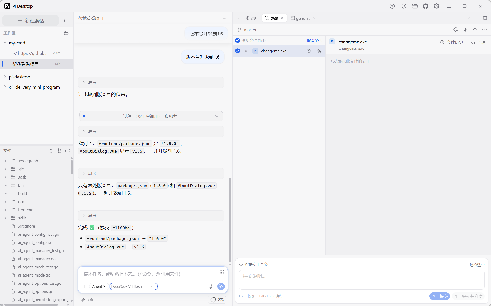
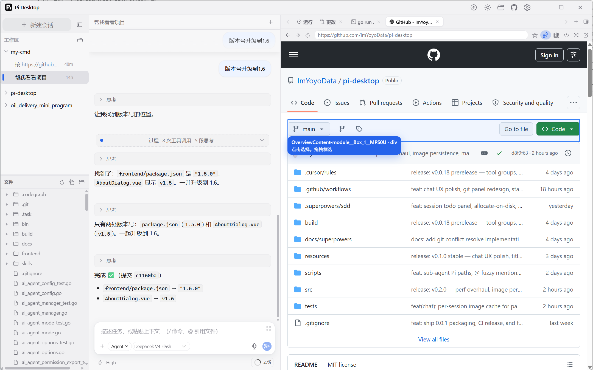

<div align="center">


# Pi Desktop

**A desktop workbench for [Pi](https://github.com/badlogic/pi-mono) coding agents** — multi-session chat, live tool streaming, embedded browser, terminal, file preview and a full Git panel in one Electron window.

[中文说明](./README.zh-CN.md) · [Releases](https://github.com/ImYoyoData/pi-desktop/releases) · [Issues](https://github.com/ImYoyoData/pi-desktop/issues)

<br />

<a href="https://github.com/ImYoyoData/pi-desktop/releases">
  
</a>
<a href="https://github.com/ImYoyoData/pi-desktop/stargazers">
  
</a>
<a href="https://github.com/ImYoyoData/pi-desktop/forks">
  
</a>
<a href="https://github.com/ImYoyoData/pi-desktop/issues">
  
</a>
<a href="https://github.com/ImYoyoData/pi-desktop/blob/dev/LICENSE">
  
</a>
<a href="https://github.com/ImYoyoData/pi-desktop">
  
</a>
<a href="https://www.electronjs.org/">
  
</a>
<a href="https://vuejs.org/">
  
</a>
<a href="https://github.com/ImYoyoData/pi-desktop">
  
</a>

<br /><br />

```text
┌─────────────┬──────────────────────┬──────────────────┐
│  Sessions   │   Agent chat stream  │  Running · Diff  │
│  + models   │   tools · ask user   │  Browser · Term  │
│  + skills   │   voice · citations  │  Preview · Git   │
└─────────────┴──────────────────────┴──────────────────┘
```

</div>

---

## Screenshots

**Chat + Git workbench** — run a task, watch the agent think and call tools, then review and commit the changes without leaving the window:



**The repo, opened in the embedded browser** — browse GitHub (or any site) and pick elements as agent context:



---

## Why Pi Desktop

Pi is a powerful coding agent. Pi Desktop wraps it in a **product-grade workbench**, so you can run many sessions, inspect every tool call, review file changes, browse with element pickers, and keep terminals open — all in one window.

### Advantages

- **Multi-session agent workspace** — parallel Pi sessions per project, each with its own model, thinking level and history, shared with the Pi CLI.
- **Transparent agent loop** — every tool call and thinking step is streamed into the chat; after the final answer everything folds into one compact “process” summary, so the answer stays clean.
- **Built-in Git workbench** — Changes panel with stage/unstage, per-file diff, commit & push, branch management, commit history with per-commit file lists, reset (soft/hard), and file-level restore.
- **Embedded browser & element picker** — open web pages, select elements/screenshots and feed them to the agent as citations and images.
- **Terminal, Preview & Running** — node-pty terminal, file preview with Monaco diffs, and a Running panel for background processes.
- **Flexible voice input** — dictation and wake-word listening backed by either on-device **CrispASR** (offline, private) or an **OpenAI-compatible cloud ASR API** of your choice.
- **Images in context** — paste images or image URLs; they are cached per session and sent to the model as base64 with a file path text-only models can locate.
- **Trust & safety** — per-workspace trust gate, bash/write permission prompts, and an allowlist.
- **Fast & light on slow machines** — lazy-loaded UI, off-main-thread PCM encoding, and no Pi SDK import in the main-process boot path.

| Layer | What you get |
| --- | --- |
| **Agent core** | Multi-session Pi runtime, streaming turns, tool cards with diffs, ask-user wizard |
| **Workbench** | Changes / Running / Browser / Terminal / Preview tabs |
| **Trust & safety** | Project trust gate, bash allowlist, permission prompts |
| **Voice** | On-device ASR or configurable cloud ASR API (OpenAI-compatible) |
| **Ship path** | NSIS + DMG per architecture via GitHub Actions on push to `main` |

---

## Tech Stack

- **Runtime**: Electron 39 · Node 22
- **UI**: Vue 3.5 · TypeScript · Naive UI · Vite (electron-vite)
- **Editor**: Monaco Editor · highlight.js · marked · KaTeX · Mermaid · @viz-js/viz
- **Agent**: [@earendil-works/pi-coding-agent](https://pi.dev) runtime in a utility-process worker
- **Terminal**: node-pty · xterm.js
- **Packaging**: electron-builder (Windows NSIS · macOS DMG · Linux)

---

## Getting Started

### Download

Grab the latest installer from the [Releases](https://github.com/ImYoyoData/pi-desktop/releases) page (Windows x64 / arm64, macOS Apple Silicon / Intel).

### Build from source

```bash
npm install
npm run dev        # development
npm run build      # bundle to out/
npm run dist:win   # or dist:mac — package installers
```

### First run

1. Open a project folder and trust it.
2. Pick a model (and set your API key under **Settings → Model** if needed).
3. Create a session and describe a task — the agent will investigate, implement, and you can review + commit from the right-hand Git panel.
4. Click the mic to enable voice input; on first use choose **Local (offline)** or **Cloud API** recognition.

---

## Project

- Repo: [github.com/ImYoyoData/pi-desktop](https://github.com/ImYoyoData/pi-desktop)
- Releases: [Releases](https://github.com/ImYoyoData/pi-desktop/releases)
- Issues & feature requests: [Issues](https://github.com/ImYoyoData/pi-desktop/issues)

## License

[MIT](./LICENSE)
