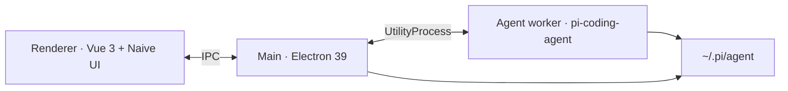

<div align="center">


# Pi Desktop

**A desktop workbench for [Pi](https://github.com/badlogic/pi-mono) coding agents** — multi-session chat, live tools, browser, terminal, and file preview in one Electron window.

[中文说明](./README.zh-CN.md) · [Releases](https://github.com/ImYoyoData/pi-desktop/releases) · [Issues](https://github.com/ImYoyoData/pi-desktop/issues)

<br />

<a href="https://github.com/ImYoyoData/pi-desktop/releases">
  
</a>
<a href="https://github.com/ImYoyoData/pi-desktop/blob/dev/LICENSE">
  
</a>
<a href="https://www.electronjs.org/">
  
</a>
<a href="https://vuejs.org/">
  
</a>
<a href="https://github.com/ImYoyoData/pi-desktop">
  
</a>

<br /><br />

```text
┌─────────────┬──────────────────────┬──────────────────┐
│  Sessions   │   Agent chat stream  │  Running · Diff  │
│  + models   │   tools · ask user   │  Browser · Term  │
│  + skills   │   voice · citations  │  Preview · Git   │
└─────────────┴──────────────────────┴──────────────────┘
```

</div>

---

## Why Pi Desktop

Pi is a powerful coding agent. Pi Desktop wraps it in a **product-grade workspace** so you can run many sessions, inspect every tool call, review file changes, browse with element pickers, and keep terminals open — without leaving one window.

| Layer | What you get |
| --- | --- |
| **Agent core** | Multi-session Pi runtime, streaming turns, tool cards with diffs |
| **Workbench** | Changes / Running / Browser / Terminal / Preview tabs |
| **Trust & safety** | Project trust gate, bash allowlist, permission prompts |
| **Local voice** | Optional on-device ASR (download on first use) |
| **Ship path** | NSIS + DMG per architecture via GitHub Actions on `main` |

---

## Highlights

<details open>
<summary><strong>Workspace</strong></summary>

- Multi-session sidebar with streaming chat and sticky context
- Tool cards for read / write / edit / bash — write shows as **additions**
- Ask-user & permission strips inline in the conversation
- Turn complete notify + file revert checkpoints

</details>

<details open>
<summary><strong>Right pane</strong></summary>

- **Running** — live agent commands with count badge when busy
- **Changes** — Git review (dugite), remotes, log, conflicts
- **Browser** — select elements → citations & screenshots in chat
- **Terminal** — PTY sessions next to the agent
- **Preview** — Monaco-backed file view / edit

</details>

<details open>
<summary><strong>Settings</strong></summary>

- Models & API keys synced with `~/.pi/agent`
- Appearance (system / light / dark) and language
- Desktop security: bash / write modes + allowlist
- Optional CrispASR runtime for mic input

</details>

---

## Platforms

| OS | Architectures | Artifact |
| --- | --- | --- |
| **Windows** | x64 · arm64 | Separate NSIS installers |
| **macOS** | x64 · arm64 | Separate DMG images |

> Electron 39+ does **not** ship Windows ia32. Use the x64 build on 64-bit Windows.

---

## Quick start

**Requirements:** Node.js **22.x**, npm **10+**, Windows or macOS.

```sh
git clone https://github.com/ImYoyoData/pi-desktop.git
cd pi-desktop
npm install
npm run icons
npm run dev
```

| Script | Purpose |
| --- | --- |
| `npm run dev` | Electron + Vite |
| `npm test` | Unit tests |
| `npm run typecheck` | `vue-tsc` |
| `npm run build` | Compile main / preload / renderer |
| `npm run dist:win:x64` · `dist:win:arm64` | Windows NSIS (one arch) |
| `npm run dist:mac:arm64` · `dist:mac:x64` | macOS DMG (one arch) |

Pi data lives under `~/.pi/agent` (override with `PI_CODING_AGENT_DIR`). First launch creates `models.json`, `auth.json`, `settings.json`, `sessions/`, `skills/`, …

Then open **Settings → Models / API Keys**.

---

## Branches & releases

| Branch | Role |
| --- | --- |
| **`dev`** | Day-to-day development & CI checks |
| **`main`** | Release line — push builds packaged GitHub Releases |

Bump `package.json` version on `dev`, merge to `main`, push `main`. Installers appear on the [Releases](https://github.com/ImYoyoData/pi-desktop/releases) page.

---

## Stack



- **UI:** Vue 3 · Pinia · Naive UI · Monaco · xterm
- **Agent:** `@earendil-works/pi-coding-agent` (+ agent-core / pi-ai)
- **Git:** dugite (bundled Git, no system Git required)
- **Voice:** optional Qwen3-ASR 0.6B Q4_K via CrispASR

---

## Star History

<div align="center">

<a href="https://www.star-history.com/#ImYoyoData/pi-desktop&Date">
  <picture>
    <source
      media="(prefers-color-scheme: dark)"
      srcset="https://api.star-history.com/svg?repos=ImYoyoData/pi-desktop&type=Date&theme=dark"
    />
    <source
      media="(prefers-color-scheme: light)"
      srcset="https://api.star-history.com/svg?repos=ImYoyoData/pi-desktop&type=Date"
    />
    
  </picture>
</a>

<sub>Adaptive light / dark chart · powered by <a href="https://www.star-history.com/">star-history.com</a></sub>

</div>

---

## Contributing

1. Work on **`dev`**
2. Keep PRs focused; run `npm test` + `npm run typecheck`
3. Prefer conventional commits (`feat`, `fix`, `chore`, `docs`, …)

Bug reports and ideas → [Issues](https://github.com/ImYoyoData/pi-desktop/issues).

---

## License

[MIT](./LICENSE) · Built for the Pi coding-agent ecosystem.
