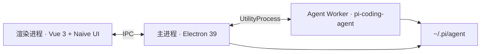

<div align="center">


# Pi Desktop

**面向 [Pi](https://github.com/badlogic/pi-mono) 编程 Agent 的桌面工作台** — 多会话对话、工具流、浏览器、终端与文件预览，一窗完成。

[English](./README.md) · [Releases](https://github.com/ImYoyoData/pi-desktop/releases) · [Issues](https://github.com/ImYoyoData/pi-desktop/issues)

<br />

<a href="https://github.com/ImYoyoData/pi-desktop/releases">
  
</a>
<a href="https://github.com/ImYoyoData/pi-desktop/blob/dev/LICENSE">
  
</a>
<a href="https://www.electronjs.org/">
  
</a>
<a href="https://vuejs.org/">
  
</a>
<a href="https://github.com/ImYoyoData/pi-desktop">
  
</a>

<br /><br />

```text
┌─────────────┬──────────────────────┬──────────────────┐
│  会话 / 模型  │   Agent 流式对话      │  运行 · Diff      │
│  Skills     │   工具 · 询问用户      │  浏览器 · 终端    │
│             │   语音 · 引用截图      │  预览 · Git       │
└─────────────┴──────────────────────┴──────────────────┘
```

</div>

---

## 为什么是 Pi Desktop

Pi 本身很强。Pi Desktop 把它装进**产品级工作台**：多会话并行、工具调用可审阅、变更可回看、浏览器可点选元素、终端常开 —— 不必来回切换窗口。

| 层次 | 你得到什么 |
| --- | --- |
| **Agent 核心** | 多会话 Pi 运行时、流式回合、带 diff 的工具卡片 |
| **工作台** | 运行 / 变更 / 浏览器 / 终端 / 预览 Tab |
| **信任与安全** | 项目信任门禁、Bash 白名单、权限询问 |
| **本地语音** | 可选端侧 ASR（首次使用时下载） |
| **发布链路** | 推送 `main` 经 Actions 产出各架构 NSIS / DMG |

---

## 亮点

<details open>
<summary><strong>工作区</strong></summary>

- 多会话侧栏 + 流式对话与粘性上下文
- read / write / edit / bash 工具卡片 — **写入按新增（+）展示**
- 对话内「询问用户」与权限条
- 回合完成通知 + 文件回退检查点

</details>

<details open>
<summary><strong>右侧面板</strong></summary>

- **运行** — 进行中命令列表，有任务时 Tab 浅黄高亮并显示数量
- **变更** — dugite Git 审阅（远端 / 日志 / 冲突）
- **浏览器** — 选元素 → 引用与截图进入对话
- **终端** — 与 Agent 并排的 PTY
- **预览** — Monaco 文件查看 / 编辑

</details>

<details open>
<summary><strong>设置</strong></summary>

- 模型与 API Key，与 `~/.pi/agent` 同步
- 外观（跟随系统 / 亮 / 暗）与语言
- 桌面安全：bash / write 模式 + 白名单
- 可选 CrispASR 麦克风输入

</details>

---

## 支持平台

| 系统 | 架构 | 产物 |
| --- | --- | --- |
| **Windows** | x64 · arm64 | 各架构独立 NSIS |
| **macOS** | x64 · arm64 | 各架构独立 DMG |

> Electron 39+ **不再提供** Windows ia32。64 位系统请使用 x64 包。

---

## 快速开始

**环境：** Node.js **22.x**、npm **10+**、Windows 或 macOS。

```sh
git clone https://github.com/ImYoyoData/pi-desktop.git
cd pi-desktop
npm install
npm run icons
npm run dev
```

| 脚本 | 用途 |
| --- | --- |
| `npm run dev` | Electron + Vite |
| `npm test` | 单元测试 |
| `npm run typecheck` | `vue-tsc` |
| `npm run build` | 编译 main / preload / renderer |
| `npm run dist:win:x64` · `dist:win:arm64` | Windows NSIS（单架构） |
| `npm run dist:mac:arm64` · `dist:mac:x64` | macOS DMG（单架构） |

Pi 数据目录：`~/.pi/agent`（可用 `PI_CODING_AGENT_DIR` 覆盖）。首次启动会准备 `models.json`、`auth.json`、`settings.json`、`sessions/`、`skills/` 等。

然后打开 **设置 → 模型 / API Keys**。

---

## 分支与发布

| 分支 | 职责 |
| --- | --- |
| **`dev`** | 日常开发与 CI |
| **`main`** | 发布线 — 推送后构建并发布 GitHub Release |

在 `dev`  bump `package.json` 版本 → 合并到 `main` → 推送 `main`。安装包见 [Releases](https://github.com/ImYoyoData/pi-desktop/releases)。

---

## 技术栈



- **界面：** Vue 3 · Pinia · Naive UI · Monaco · xterm
- **Agent：** `@earendil-works/pi-coding-agent`（及 agent-core / pi-ai）
- **Git：** dugite（内置 Git，不依赖系统 Git）
- **语音：** 可选 Qwen3-ASR 0.6B Q4_K（CrispASR）

---

## Star History

<div align="center">

<a href="https://www.star-history.com/#ImYoyoData/pi-desktop&Date">
  <picture>
    <source
      media="(prefers-color-scheme: dark)"
      srcset="https://api.star-history.com/svg?repos=ImYoyoData/pi-desktop&type=Date&theme=dark"
    />
    <source
      media="(prefers-color-scheme: light)"
      srcset="https://api.star-history.com/svg?repos=ImYoyoData/pi-desktop&type=Date"
    />
    
  </picture>
</a>

<sub>随系统亮 / 暗色切换 · 数据来自 <a href="https://www.star-history.com/">star-history.com</a></sub>

</div>

---

## 参与贡献

1. 在 **`dev`** 上开发
2. PR 保持聚焦；本地跑 `npm test` + `npm run typecheck`
3. 推荐约定式提交（`feat` / `fix` / `chore` / `docs` …）

问题与想法 → [Issues](https://github.com/ImYoyoData/pi-desktop/issues)。

---

## 许可证

[MIT](./LICENSE) · 服务于 Pi coding-agent 生态。
